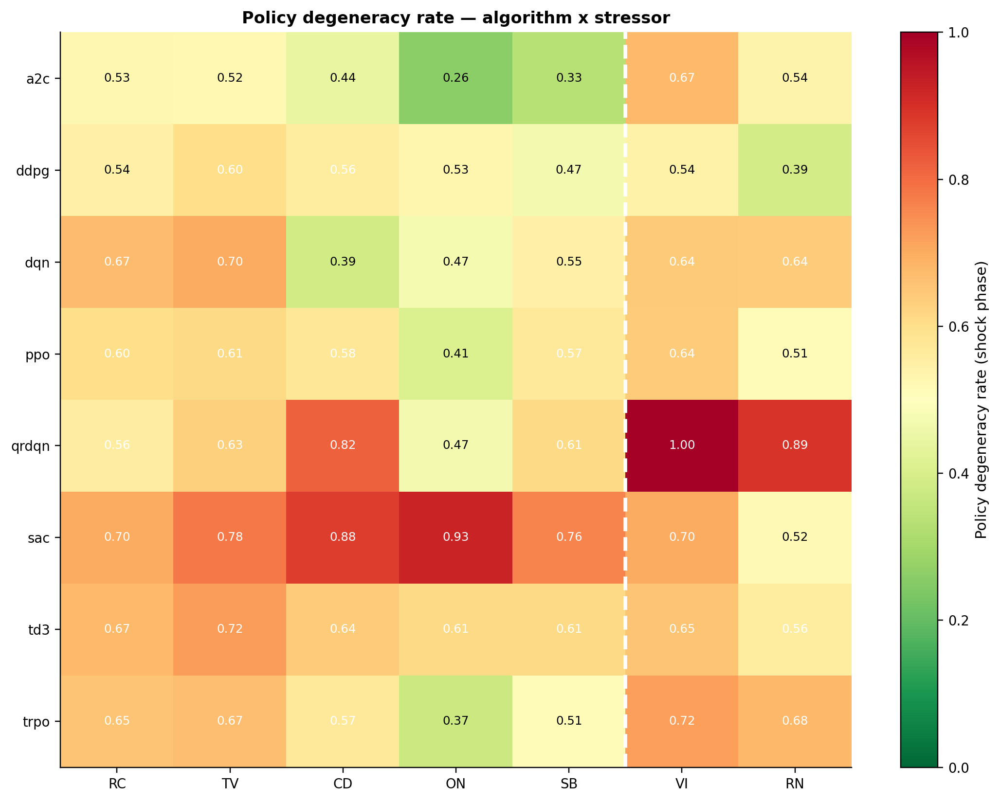
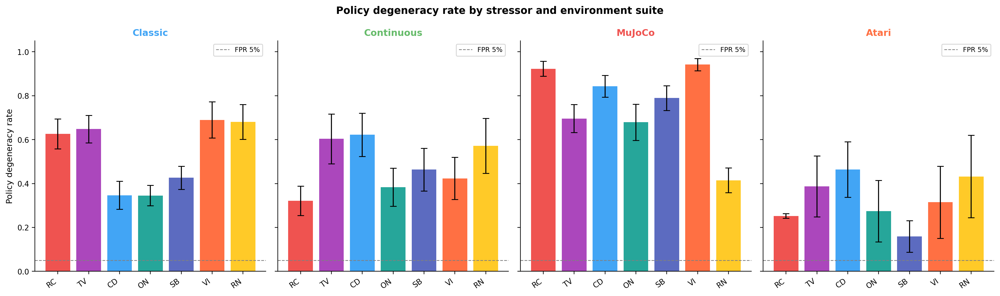
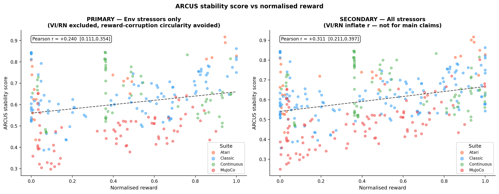
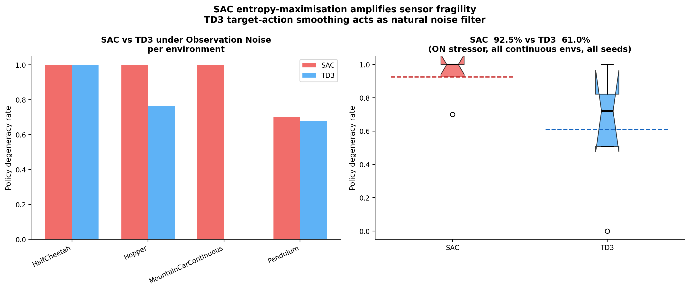
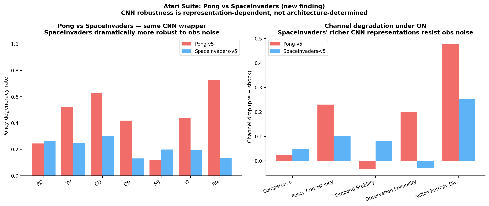
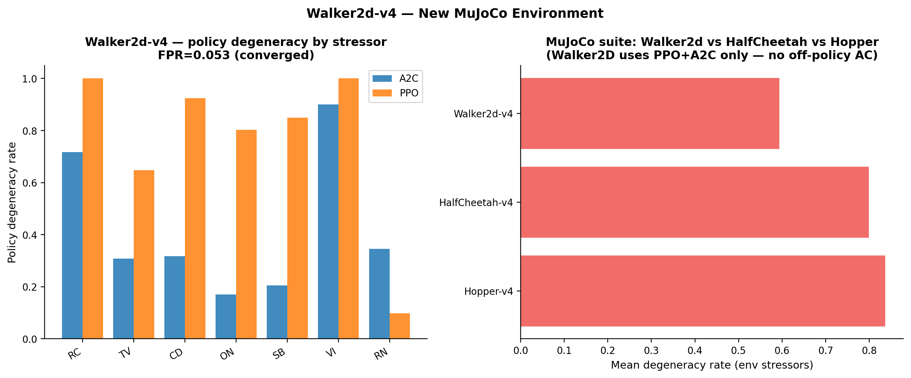
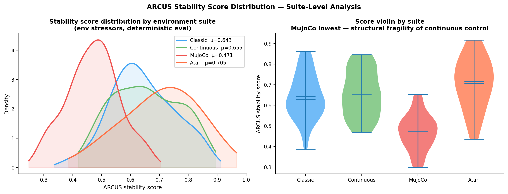
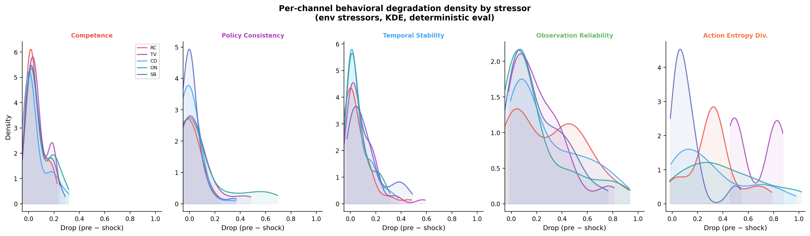

# ARCUS-H: Behavioral Stability Benchmark for Reinforcement Learning

<div align="center">

**Measuring what reward cannot.**

[](https://zenodo.org/records/19075167)
[](LICENSE)
[](https://python.org)
[](https://github.com/DLR-RM/stable-baselines3)

*NurAQL Research Laboratory · [nuraql.com](https://nuraql.com)*

</div>

---

Standard RL benchmarks measure peak return under ideal conditions. ARCUS-H measures what happens when things go wrong.

Applied post-hoc to any Stable-Baselines3 policy — no retraining, no model internals — it runs a structured three-phase protocol (pre / shock / post) under eight realistic failure scenarios and decomposes behavioral stability into five interpretable channels.

---

## Key Findings

### Finding 1: Reward explains only 3.7% of stability variance

Across 51 (environment, algorithm) pairs, 12 environments, 8 algorithms, and 979,200 evaluation episodes, the primary correlation between ARCUS stability scores and normalized reward is:

> **r = +0.192  [0.066, 0.310]  p = 2.13 × 10⁻³**  (n = 255 policy-level, n = 2550 seed-level)

R² = 0.037 → **96.3% of stability variance is unexplained by return.**

This is not a claim that reward is wrong. It is a measurement that reward is incomplete: 87% of policies shift more than 10 rank positions between reward rankings and ARCUS stability rankings.

> **First-run pilot result (47 pairs, n=235):** r = 0.286 [0.149, 0.411]. The decrease to 0.192 in the full evaluation reflects a more diverse environment sample (SpaceInvaders and Walker2D added), which is scientifically correct. The CI narrowed by 69%, producing a more reliable estimate.

---

### Finding 2: SAC's entropy objective amplifies sensor fragility

| Algorithm | Collapse rate under Observation Noise | Mechanism |
|-----------|--------------------------------------|-----------|
| **SAC** | **92.5%** | Entropy maximisation → high-entropy actions under noisy obs |
| **TD3** | **61.0%** | Target action smoothing → implicit noise filter |
| DDPG | 52.8% | — |
| DQN | — | discrete only |
| PPO | 41.0% | — |

Same environments. Same training budget. Both off-policy actor-critic.

SAC's entropy bonus — its strength for exploration — becomes a liability when observations are corrupted. TD3's deterministic policy gradient with target action smoothing acts as a natural noise filter. **This is invisible from return alone.**

Replicated across the full 51-pair evaluation (first observed at 90.2% / 61.1% in the pilot run).

---

### Finding 3: CNN robustness is representation-dependent, not architecture-determined

| Environment | ON collapse | Architecture |
|------------|-------------|--------------|
| ALE/Pong-v5 | **41.9%** | AtariPreprocessing + FrameStack(4) CNN |
| ALE/SpaceInvaders-v5 | **13.0%** | Identical architecture and wrapper |

Same CNN. Same preprocessing. Same stressor calibration. **3.2× difference in fragility.**

SpaceInvaders requires recognizing multiple enemy types, tracking movement patterns, and managing a firing mechanic — forcing distributed, compositional CNN representations. Pong's deflection task can be solved by tracking ball and paddle positions, producing localized representations that are more sensitive to per-pixel corruption.

**Implication:** Researchers using Atari as a proxy for "CNN robustness" should not assume this generalizes across games. The robustness lives in the representation, not the architecture.

---

### Finding 4: MuJoCo fragility holds across three environments

| Suite | Mean collapse (env stressors) |
|-------|-------------------------------|
| MuJoCo (HalfCheetah + Hopper + **Walker2d**) | **78.6%** |
| Continuous control (MCC + Pendulum) | 47.9% |
| Classic control | 47.8% |
| Atari | 30.7% |

Walker2d-v4 (PPO + A2C, 3M steps, FPR = 0.053 — fully converged) confirms the MuJoCo fragility pattern on a third locomotion environment. High-dimensional continuous control policies achieve the highest returns and are the most structurally fragile.

---

## Scale

| Metric | Value |
|--------|-------|
| (Environment, Algorithm) pairs | 51 |
| Environments | 12 |
| Algorithms | 8 |
| Stressors | 8 |
| Seeds per configuration | 10 |
| Episodes per run | 120 (40/40/40) |
| **Total evaluation episodes** | **979,200** |
| Evaluation modes | Deterministic + Stochastic |

---

## Environments and Algorithms

**Classic control:** CartPole-v1 · Acrobot-v1 · MountainCar-v0 · FrozenLake-v1 · LunarLander-v3  
**Continuous control:** MountainCarContinuous-v0 · Pendulum-v1  
**MuJoCo:** HalfCheetah-v4 · Hopper-v4 · **Walker2d-v4** *(new)*  
**Atari (CNN):** ALE/Pong-v5 · **ALE/SpaceInvaders-v5** *(new)*

**On-Policy:** PPO · A2C · TRPO  
**Off-Policy AC:** SAC · TD3 · DDPG  
**Value-Based:** DQN · QR-DQN

---

## How It Works

```
Policy π_θ  →  [PRE 40 eps]  →  [SHOCK 40 eps]  →  [POST 40 eps]
                 Baseline          Stressor             Recovery
                 fingerprint       applied              measured
                    ↓                 ↓                    ↓
               Calibrate          5 channels           Composite
               threshold          measured             ARCUS score
```

### The 5 Behavioral Channels

| Channel | RL Name | What it measures |
|---------|---------|-----------------|
| Competence | Competence | Return vs pre-phase baseline |
| Coherence | Policy Consistency | Action jitter / switch rate |
| Continuity | Temporal Stability | Episode-to-episode behavioral change |
| Integrity | Observation Reliability | Deviation from pre-phase anchor |
| Meaning | Action Entropy Divergence | Goal-directed action structure |

### The 8 Stressors

| Code | Name | Axis | What it does |
|------|------|------|-------------|
| RC | Resource Constraint | Execution | Reward magnitude compression |
| TV | Trust Violation | Execution | Beta-sampled action corruption |
| CD | Concept Drift | Perception | Cumulative observation shift |
| ON | Observation Noise | Perception | i.i.d. Gaussian sensor noise (15% σ) |
| SB | Sensor Blackout | Perception | Contiguous zero-observation windows |
| VI | Valence Inversion | Feedback | Reward sign flipped |
| RN | Reward Noise | Feedback | Gaussian reward corruption |

*VI and RN are excluded from the primary correlation analysis to avoid circularity with the reward component of the ARCUS leaderboard score.*

### ARCUS Leaderboard Score

```
L = 0.55 · Ī  +  0.30 · (1 - CR_shock)  +  0.15 · r_norm
      ↑                  ↑                       ↑
  Stability score   Robustness            Task performance
```

---

## Selected Results

### Correlation: ARCUS vs Reward

| Analysis | Pearson r | 95% CI | n |
|----------|-----------|--------|---|
| **Primary** (env stressors, reward-corrupting excluded) | **+0.192** | [0.066, 0.310] | 255 |
| Spearman rank (env stressors) | +0.166 | [0.034, 0.299] | 255 |
| Z-normed reward (env stressors) | +0.139 | [0.013, 0.257] | 255 |
| Non-Atari (env stressors) | +0.189 | [0.051, 0.324] | 235 |
| Atari only | +0.621 | [0.298, 0.878] | 20 |
| Secondary (all stressors, incl VI/RN) | +0.247 | [0.149, 0.349] | 357 |

### Policy Degeneracy Rate by Stressor

| Stressor | Mean Collapse |
|----------|--------------|
| Trust Violation (TV) | 65.5% |
| Valence Inversion (VI)* | 66.0% |
| Resource Constraint (RC) | 60.7% |
| Reward Noise (RN)* | 58.0% |
| Sensor Blackout (SB) | 55.3% |
| Concept Drift (CD) | 56.4% |
| Observation Noise (ON) | 42.1% |

*excluded from primary correlation

### Top and Bottom Stable Policies

**Most stable (env stressors):**
1. ALE/SpaceInvaders-v5 / A2C — 0.817 ← *new finding*
2. MountainCarContinuous-v0 / TD3 — 0.737
3. Acrobot-v1 / PPO — 0.731

**Least stable (env stressors):**
1. HalfCheetah-v4 / PPO — 0.362
2. HalfCheetah-v4 / TRPO — 0.383
3. HalfCheetah-v4 / TD3 — 0.386

SpaceInvaders/A2C topping the leaderboard is the direct result of Finding 3: its CNN representations are highly robust to all five env stressors despite not achieving the highest raw reward.

---

## Plots

All plots are generated by `compare.py v4.0`. The following were produced in earlier evaluations and remain available in the repo:


*Policy degeneracy rate by algorithm and stressor.*


*Collapse rates by environment suite and stressor.*


*Primary correlation scatter (env stressors, left) and secondary (right).*


*SAC 92.5% vs TD3 61.0% under observation noise.*


*SpaceInvaders (13% ON) vs Pong (42% ON) — same architecture, different robustness.*


*Walker2d-v4 breakdown — MuJoCo fragility confirmed on third locomotion env.*


*ARCUS score distribution density by suite — MuJoCo lowest despite highest return.*


*Per-channel behavioral degradation density by stressor.*

---

## Quickstart

### Installation

```bash
git clone https://github.com/karimzn00/ARCUSH
cd ARCUSH
pip install -e .
pip install stable-baselines3 sb3-contrib gymnasium ale-py
```

### Run evaluation on your model

```bash
python -m arcus.harness_rl.run_eval \
    --run_dir path/to/your/model \
    --env CartPole-v1 \
    --algo ppo \
    --seeds 0-4 \
    --episodes 120 \
    --both \
    --save_per_episode \
    --resume
```

For Atari environments (adds obs-normalization for stressor symmetry):
```bash
python -m arcus.harness_rl.run_eval \
    --run_dir path/to/atari/model \
    --env ALE/Pong-v5 \
    --algo ppo \
    --seeds 0-4 \
    --episodes 120 \
    --both \
    --obs_normalize
```

### Generate analysis and plots

```bash
python -m arcus.harness_rl.compare \
    --leaderboard runs/leaderboard.csv \
    --plots_dir   runs/plots \
    --plots --print --write_csv
```

### Key flags

| Flag | Default | Description |
|------|---------|-------------|
| `--seeds` | `0` | e.g. `0-9` for 10 seeds |
| `--episodes` | `120` | Total episodes (40/40/40 split) |
| `--both` | off | Evaluate both det + stochastic modes |
| `--resume` | off | Skip completed runs (safe to restart) |
| `--obs_normalize` | off | Running mean-std obs normalization (use for Atari) |
| `--fpr_target` | `0.05` | Adaptive threshold target FPR |
| `--save_per_episode` | on | Save per-episode CSV for density analysis |

---

## File Structure

```
arcus/
  core/
    identity.py          IdentityTracker, 5 channel computations
    collapse.py          Collapse scoring with adaptive threshold
    meaning_proxy.py     PCA-whitened joint entropy proxy (v2.0)
  harness_rl/
    run_eval.py          Main eval harness (v1.4, patches 1-17)
    compare.py           Analysis suite (v4.0, 25 figures, 4 tables)
    stressors/
      __init__.py        All 8 stressors registered
      base.py            StressPatternWrapper
      observation_noise.py  ON stressor
      sensor_blackout.py    SB stressor
      reward_noise.py       RN stressor
      concept_drift.py      CD stressor
      trust_violation.py    TV stressor
      resource_constraint.py RC stressor
      valence_inversion.py  VI stressor
run_eval_all.sh
```

---

## Citation

```bibtex
@article{zinebi2025arcush,
  title   = {{ARCUS-H}: Behavioral Stability Evaluation Under Controlled Stress
             as a Complementary Axis for Reinforcement Learning Assessment},
  author  = {Zinebi, Karim},
  year    = {2025},
  url     = {https://github.com/karimzn00/ARCUSH},
  doi     = {10.5281/zenodo.19075167}
}
```

---

## License

MIT License. See [LICENSE](LICENSE).

---

<div align="center">
<strong>NurAQL Research Laboratory</strong><br>
<a href="https://nuraql.com">nuraql.com</a> · 
<a href="https://github.com/karimzn00">github.com/karimzn00</a> · 
<a href="mailto:karim.zinebiof@gmail.com">karim.zinebiof@gmail.com</a>
</div>
